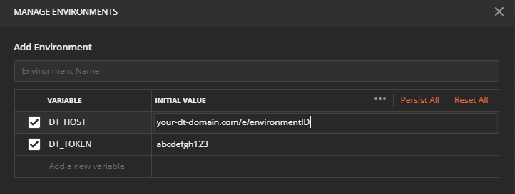
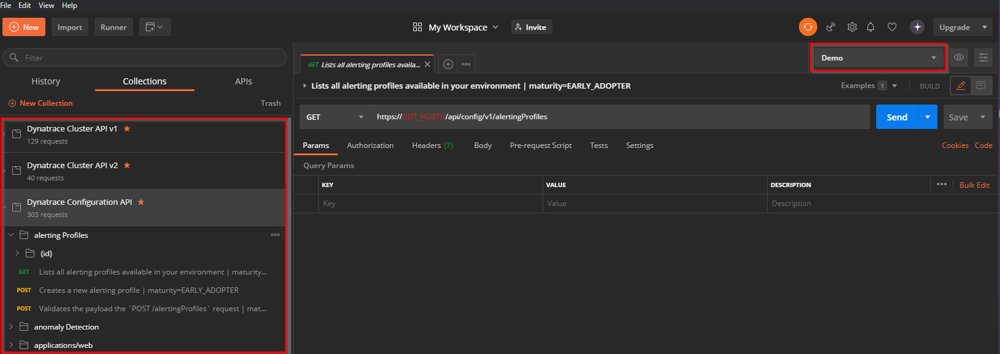

# Postman Collections for Dynatrace APIs
This is a summary of [postman](https://www.postman.com/) collections for all dynatrace APIs.  
I've added variables to make them  easy to use with multiple dynatrace clusters, environments and tenants by utilizing [Postman environments](https://learning.postman.com/docs/sending-requests/managing-environments/)

The master branch includes the latest version, older versions are available in separate branches.

# How to

## Import collections
Import (`file -> import`) the [collection](https://learning.postman.com/docs/sending-requests/intro-to-collections/) .json file for the APIs you want:  
* [Environment API v1](specs/Dynatrace-Environment-API-v1.postman_collection.json)
* [Environment API v2](specs/Dynatrace-Environment-API-v2.postman_collection.json)
* [Configuration API](specs/Dynatrace-Configuration-API.postman_collection.json)
* [Cluster API v1](specs/Dynatrace-Cluster-API-v1.postman_collection.json)
* [Cluster API v2](specs/Dynatrace-Cluster-API-v2.postman_collection.json)

A separate collection will be created for each API:

## Create environments
For each of your dynatrace environments you want to use, add a postman environment via `manage environments -> add`:  

The environment needs two variables:
* DT_HOST
  * URL to the environments
    * For managed: `your-dt-domain.com/e/Environment-ID`
      * `example.com/e/b80b158e-ev23-4330-30fcc-c4391bbx6ce2`
    * For managed (Cluster API): 
    * For SaaS: `Env-ID.live.dynatrace.com`
      * `abc133769.live.dynatrace.com`
* DT_TOKEN
  * An API token for the environment

## Request away!

Now you can open any request and easily execute it against different dynatrace environments by selecting the environment on the top right:

